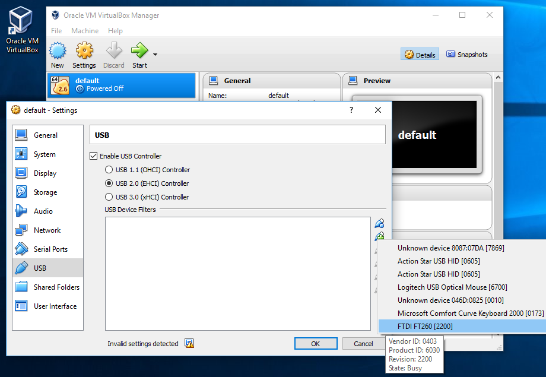
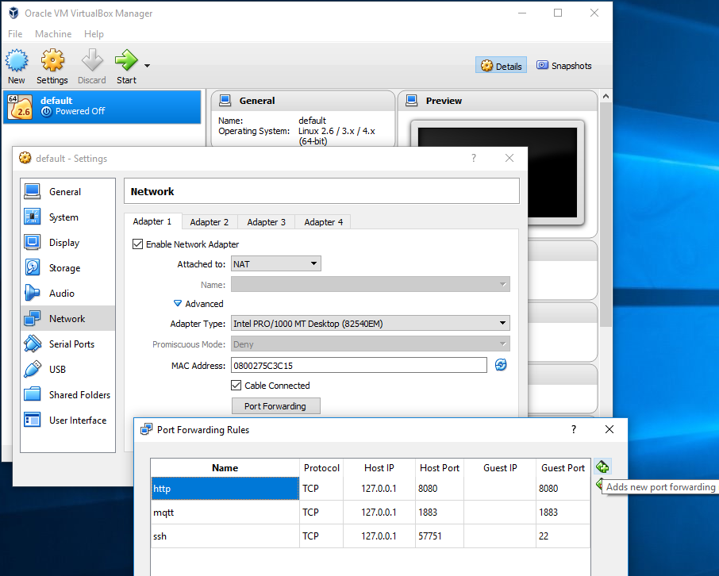

# BigClown Alpha - Software Setup for Microsoft Windows Host Platform

## Prerequisites

- Microsoft Windows 7, 10 (64bit with CPU virtualization support enabled)
- Administrator rights
- Internet connectivity
- USB cable, Bridge Module and sensors/actuators (Tags, Modules)

## Download and install DockerToolbox

Download [DockerToolbox-1.12.2.exe](https://github.com/docker/toolbox/releases/download/v1.12.2/DockerToolbox-1.12.2.exe), open it and follow installation instructions (you may use Docker’s [installation manual](https://docs.docker.com/toolbox/toolbox_install_windows/#/step-2-install-docker-toolbox)).

Allow VirtualBox through Windows Firewall.

Start **Docker Quickstart Terminal**.

Run `docker-machine stop` and then `exit`.

Download [VirtualBox 5.1.8 Oracle VM VirtualBox Extension Pack](http://download.virtualbox.org/virtualbox/5.1.8/Oracle_VM_VirtualBox_Extension_Pack-5.1.8.vbox-extpack) (SHA1 2c1e2f5564e9ea5c704021630c87cb70a7bf38e5) and install it.

## Configure VirtualBox USB and Network

Connect Bridge Module with USB cable.

Start **Oracle VM VirtualBox**

Add USB config for FT260 of default virtual machine

Add Network Port Forwarding in Adapter 1 (NAT) of **default** virtual machine for HTTP and MQTT.

## Configure Docker

Start **Docker Quickstart Terminal**

Disconnect Bridge Module from USB.

Connect Bridge Module with USB cable.

`mkdir -v $HOME/hub`

Note created directory (looks like /c/Users/<USERNAME>/hub) - "host directory" in references below.

## Run Clown.Hub software on Microsoft Windows

BigClown uses Docker container technology for seamless software delivery.

Pull Docker image from Docker Hub and run the container in one command:

`docker run -d -p 8080:8080 -p 1883:1883 --privileged -v /dev:/dev -v $HOME/hub:/var/hub -h hub-container --name hub clown/hub`

You can stop container by: 

`docker stop hub`

And start it again by: 

`docker start hub`

## Open the browser and play with the gadgets

Navigate to URL:

<https://hub.local:8080/dashboard> or <https://localhost:8080/dashboard>

Be aware that the connection is not encrypted, so it’s not safe to access it over public internet.

## MQTT playground

Look at measured values (this will subscribe to messages from MQTT broker
running inside the container):

`docker exec hub mosquitto_sub -v -t 'nodes/bridge/0/#'`

Set relay to "true" state (this will publish message to MQTT broker
running inside the container):

`docker exec hub mosquitto_pub -t nodes/bridge/0/relay/i2c0-3b/set
 -m '{"state": true}'`

Set relay to "false" state:

`docker exec hub mosquitto_pub -t nodes/bridge/0/relay/i2c0-3b/set
 -m '{"state": false}'`

If you want to see values from a simulator (running as parallel process
inside the container):

`docker exec hub mosquitto_sub -v -t 'nodes/bridge/simulator/#'`
